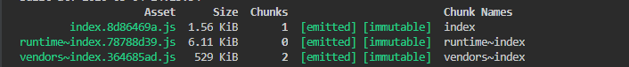

# 用 Webpack 实现 predictable long term cache

题目链接： [传送门](https://github.com/LeetCode-OpenSource/hire/blob/master/webpack_zh.md)

首先解释下 predictable long term cache（持久缓存）。
webpack在打包代码过程中可以在输出资源的时候添加`hash`，来表示资源的更新。
所谓的持久缓存，即在这个添加`hash`的过程中，对那些没有改变的代码，`hash`值需要保持不变。典型的场景是，第三方引用的库一般更新频次都是比较低的，打包的时候希望业务代码变更的时候，不要改变这些公共资源的hash值，以达到资源缓存最大化的目的。

## webpack hash

webpack支持三种hash值

- hash 即单次打包的hash, 意味着每次build,hash都会变更
- chunkhash, 根据不同的入口文件(Entry)进行依赖文件解析、构建对应的chunk，生成对应的哈希值
- contenthash，基于文件内容的hash，意味着只有文件内容变化了，hash才会变更

更多的区别，可以参考[这里](https://juejin.im/post/5a4502be6fb9a0450d1162ed)

## 实现长缓存

要实现持久缓存，其实问题就转换成了如果稳定webpack打包出来的hash值。下面首先来看一下webpack打包的过程，一个或多个资源文件(js/css/image)组成`module`，一个或多个`module`组成`chunk`，如 `entry chunk`，`vendor chunk`等。每一个chunk最终生成一个file，`chunkhash`是根据每个`chunk`的内容产生的.

先看一个基于`chunkhash`简单配置的打包结果

```javascript
// index.js
import "./lib/a.js"
console.log("this is index")

// lib/a.js
import {cloneDeep} from 'lodash'
console.log(cloneDeep({name: 'a'}))

// webpack.config.js
module.exports = {
    entry: {
     index:'./src/index.js',
    },
    output: {
        path: path.join(__dirname, './dist'),
        filename: '[name].[chunkhash:8].js',// 使用chunkhash
    },
    mode: 'none',
    optimization: {
        runtimeChunk: true,
        splitChunks: {
            chunks: 'all',
        },
    }
}

```



打包出来有三个文件，index,runtime和vendors.下面来看一下三个文件分别是什么, index就是入口entry打包出来的文件。runtime.js是webpack运行环境（模块解析，模块加载）及模块信息清单的代码，什么意思呢? webpack打包出来是一个IFEE结构, 简单理解runtime就是下面这部分的代码，不包含modules的部分，

```javascript
(function (modules){
    var installedModules = {};
    function __webpack_require__(moduleId){
        if(installedModules[moduleId]){
            return installedModules[moduleId].exports
        }
        var module = installedModules[moduleId] = {
            i: moduleId,
            l: false,
            exports: {}
        };
        modules[moduleId].call(module.exports, module, module.exports,__webpack_requre__);
        module.l = true;
        return module.exports;
    }
    __webpack_require__(0)
})([
   // ...modules
])
```

注意，需要配置`optimization.runtimeChunk`才会拆分这部分代码，modules是会变更的，runtime几乎不需要变，因此将这部分代码拆分出去进行缓存也是一个好的策略。

最后看下vendors，vendors是通过配置`optimization.splitChunks`生成的，

更多splitChunks的配置策略可以参考[Webpack 4 配置最佳实践](https://zxc0328.github.io/2018/06/19/webpack-4-config-best-practices/),内置的代码切分的规则是这样的：

- 新 bundle 被两个及以上模块引用，或者来自 node_modules
- 新 bundle 大于 30kb （压缩之前）
- 异步加载并发加载的 bundle 数不能大于 5 个
- 初始加载的 bundle 数不能大于 3 个

这里的vendors是将lodash里的cloneDeep函数单独拆成了一个chunk。下面给index.js内增加一个新的模块b.js

### 1. 改变模块依赖

```javascript
// b.js
console.log("this is b");

// index.js
import "./lib/b.js"
import "./lib/a.js"
console.log("this is index")
```

这里我们期望的是只有index的hash值变化，vendor和runtime都不应该变化，但是打包后的结果导致index和vendors的hash都变化了，这就不对了。而且, 如果把import b 放在import a的后面，则只有 index 的hash变化，符合预期，这到底是什么原因造成的呢？原因就是，webpack4中,chunk都是通过一个自增id进行标识，当在 import a 之前引入 b 时，破坏了原先的id顺序，因此也就导致chunkhash的变化。幸好，webpack也提供了解决办法，就是配置 `optimization.moduleIds: 'hashed'`。so easy. 解决的原理用模块路径取代自增id，这样，增加新的模块，之前的chunk也不会受到影响。

### 2. 添加css模块

```javascript
// index.css
body{color: red}

// index.js
import "./lib/index.css"
import "./lib/b.js"
import "./lib/a.js"
console.log("this is index")
```

webpack增加对css的配置，用mini-css-extract-plugin这个插件将css单独打包成一个文件。

```javascript
// webpack.config.js
const MiniCssExtractPlugin = require("mini-css-extract-plugin")
module.exports = {
    entry: {
     index:'./src/index.js',
    },
    output: {
        path: path.join(__dirname, './dist'),
        filename: '[name].[chunkhash:8].js',// 使用chunkhash
    },
    mode: 'none',
    optimization: {
        runtimeChunk: true,
        splitChunks: {
            chunks: 'all',
        },
    },
       module: {
        rules: [{
                test: /\.css$/,
                include: [
                    path.resolve(__dirname, 'src')
                ],
                use: [
                    {loader: MiniCssExtractPlugin.loader},
                    {loader: 'css-loader'}
                ]
            }]
    },
    plugins: [
        new MiniCssExtractPlugin({
            filename: '[name].[contenthash:8].css',
            chunkFilename: '[name].[contenthash:8].css'
        }),
    ],
}

```

因为打包后css是单独一个文件，并不影响js资源，所以期望修改css文件后，所有js的hash值都不应该变化，但是结果并非如此：当css变化时，入口文件index.js的hash值也跟着变化了。

解决办法就是用到之前提到的`contenthash`, 修改一下webpack的配置：

```javascript
...
    output: {
        path: path.resolve(__dirname, './dist'),
        // 改成contenthash
        filename: '[name].[contenthash:8].js'
    },
...
```  

### 3. 增加异步模块

修改入口文件如下：

```javascript
// lib/async.js
export default {
    content: 'async'
};

import './index.css';
import './lib/b'
import './lib/a'

// 增加异步模块
import('./lib/async').then(a=>console.log(a))

document.write("hello")
```

打包后发现,异步模块会随着异步模块的增减顺序，而产生不同的hash值。这时因为我们固定了moduleId,却没有固定chunkId。异步模块由于没有chunk.name，最后还是使用了自增id进行命名。当然，webpack强大的插件机制又帮我们解决了这个问题：webpack.NamedChunksPlugin.解决办法如下：

```javascript
// webapck.config.js
...
plugin:{
      new webpack.NamedChunksPlugin(
            chunk => chunk.name || Array.from(chunk.modulesIterable, m => m.id).join("_")
     ),
        ...
}
...
```

perfect!

## 总结

综上，一个基于webpack4的持久缓存方案就诞生了。根本思路还是取代自增数字用作chunk的标识，同时采用contenthash取代chunkhash。
完整的webpack配置如下：

```javascript
// webapck.config.js
const path = require("path");
const webpack = require("webpack");

const MiniCssExtractPlugin = require("mini-css-extract-plugin")

module.exports = {
    entry: {
     index:'./src/index.js',
    },
    output: {
        path: path.join(__dirname, './dist'),
        filename: '[name].[contenthash:8].js',
    },
    mode: 'production',
    optimization: {
        runtimeChunk: true,
        splitChunks: {
            chunks: 'all',
        },
        moduleIds: 'hashed'
    },
    module: {
        rules: [
            {
                test: /\.css$/,
                include: [
                    path.resolve(__dirname, 'src')
                ],
                use: [
                    {loader: MiniCssExtractPlugin.loader},
                    {loader: 'css-loader'}
                ]
            }
        ]
    },
    plugins: [
        new MiniCssExtractPlugin({
            filename: '[name].[contenthash:8].css',
            chunkFilename: '[name].[contenthash:8].css'
        }),
        new webpack.NamedChunksPlugin(
            chunk=>chunk.name || Array.from(chunk.modulesIterable, m=>m.id).join("_")
        )
    ],

}
```

## 参考

[基于webpack4[.3+]构建可预测的持久化缓存方案](https://github.com/jiangjiu/blog-md/issues/49) 

[webpack optimization 文档](https://webpack.docschina.org/configuration/optimization/#optimization-moduleids) 

[对Webpack的hash稳定性的初步探索](https://zhuanlan.zhihu.com/p/35093098) 

[webpack 4: Code Splitting, chunk graph and the splitChunks optimization](https://medium.com/webpack/webpack-4-code-splitting-chunk-graph-and-the-splitchunks-optimization-be739a861366) 

[Webpack 4 配置最佳实践](https://zxc0328.github.io/2018/06/19/webpack-4-config-best-practices/) 
