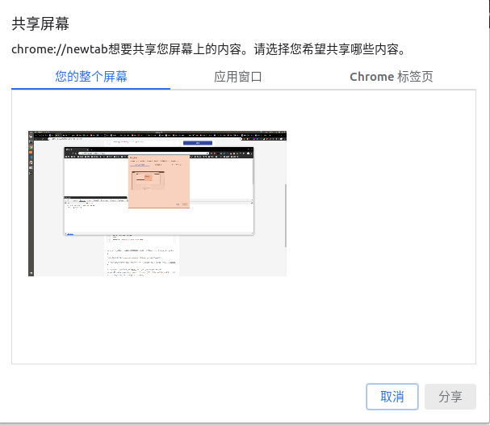

# WEB 端是如何录屏的？

提到录屏，大家可能都回想这应该属于客户端的能力，不过我们知道随着 H5 的发展，越来越多原生开发才能做的事情，通过 WEB 也能够实现了。`录屏`也不例外。

W3C 在 2013 年就制定了相应的 web 标准，称为 [MediaRecorder API](https://developer.mozilla.org/en-US/docs/Web/API/MediaRecorder)（旧称 MediaStream Recording API）。具体 api 细节这里就不展开了，总结一下步骤就是先获取一个 MediaStream，然后调用 new MediaRecorder(mediaStrean) 生成 recorder 实例，最后录制视频。

这里值得注意的是如果获取 MediaStream？

如果整个 WEB 应用都是用 canvas 绘制的(比如游戏)，那么比较简单，直接使用 canvas 提供的 api: [captureStream](https://developer.mozilla.org/en-US/docs/Web/API/HTMLMediaElement/captureStream)

```javascript
// 基于 canvas 录屏
const chunks = [];
const stream = canvas.captureStream;
const recorder = new MediaRecorder(stream);
recorder.addEventListener("dataavailable", e => chunks.push(e.data));

// 开始录屏
recorder.start();

// 结束录屏
recorder.stop();

// blob
const blob = new Blob(chunks, {
  type: "video/webm"
});
```

如果不是 canvas，仅仅是普通的网页，那么需要先调用 navigator.mediaDevices.getDisplayMedia 获取屏幕流

```javascript
// ...
const stream = await navigator.mediaDevices.getDisplayMedia();
// ...
```

不同的是，`getDisplayMedia` 获取的媒体流已经不限于浏览器，甚至是其他应用窗口或者是整个屏幕


虽然基于 MediaRecorder，我们已经很方便的实现录屏了，但还是有几个问题：

- 兼容性问题，目前仅有 Chrome 和 FireFox 支持，IOS 和 IE 都不支持
- 针对网页的录屏 会弹出窗口，中断用户的操作，体验不好
  > 如果是浏览器插件，可以直接调用 chrome 的接口 [chrome.desktopCapture](https://developer.chrome.com/extensions/desktopCapture) 获取某个 tab 页的 MediaScream，也不会出现弹框
- 在某些特定的场景，比如需要实时上传录屏结果的如直播、异常监控等，录屏后的文件还是太大了。

那么还有没有更好的 WEB 端解决方案呢？

之前在知乎上看到过这样一个问题 [《魔兽争霸》的录像，为什么长达半小时的录像大小只有几百 KB？](https://www.zhihu.com/question/25431134/answer/30779048)。相信很多喜欢游戏的同学，特别是玩过 DOTA 或者魔兽争霸的应该都产生过这样的疑问。

我们知道游戏都会有地图，看录像的时候需要重新加载一次地图，否则直接下载的录像是不能播放的，那么可以推测出来的是下载的录像肯定不是一个视频文件，而是一堆用户的操作记录或状态记录，即`剧本`，最后配合着地图这个场景重新渲染出来了而已。

看到这里，大家就会想这不和 web 很像吗？web 应用必须在浏览器里才能打开，那么浏览器就相当于是`游戏地图`，dom 操作就是`剧本`，如果我们需要让回放结果只能在浏览器内打开，那么录制过程只需要记录 dom 操作即可。

去年 D2 论坛，阿里的小伙伴做了一个分享：《XREPLAY-云端录屏及回放解决方案》，据说可以将 HTML 页面上的任何行为一帧帧的记录下来，用于录播或直播，并且性能极高、体积极小。可惜没找到相关 PPT 和演讲视频。

不过社区也有开源实现，[rrweb](https://github.com/rrweb-io/rrweb)，相关原理介绍可以看这里：[rrweb：打开 web 页面录制与回放的黑盒子](https://zhuanlan.zhihu.com/p/60639266)

简单总结一下就是：

```js
先对 DOM 进行快照 -> 记录元素变化的 ACTION -> 模拟鼠标轨迹 -> 高精度计时器 -> 压缩上传
```

另外，由于对用户操作行为的记录，最后录屏的数据其实还可以做一些用户行为的收集和分析。而且也没有兼容性问题(哈哈，真香！)。
