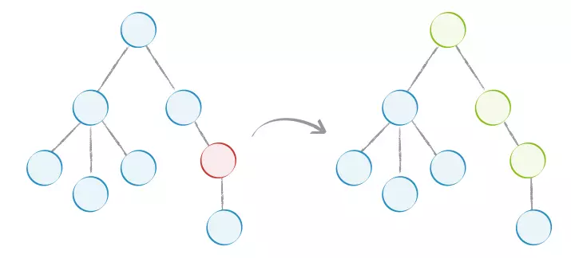

# 不一样的深拷贝实现思路

面试的时候相信大家经常会遇到深拷贝的题目，一般面试者回答的答案主要就两种:

- JSON.parse(JSON.stringify(a))
- 递归浅拷贝

第一种方法存在明显的局限性，很多情况下不可以使用，比如遇到function就会丢失，遇到正则表达式，则拷贝后的对象会变成Object;
遇到递归引用，直接报错等。

第二种方式有很多著名的库都有实现, lodash/underscore/jquery等，不过这里我们先来自己实现一个简单的深拷贝

```javascript
const clone = (obj) => {
    let _target = Array.isArray(obj) ? [] : {}
    for (let k in obj) {
        _target[k] = typeof obj[k] === 'object' ? clone(obj[k]) : obj[k]
    }
    return _target
}
```

恩，很简单，首先判断下是否是数组，然后一个递归就完了。下面测试一下:

```javascript
const source = {
    a: 1,
    b: function () { console.log(1) },
    c: /s/,
    d: new Date(),
    e: {name: 1},
    f: [{name: 2}, 2,3,4]
}

const target = clone(source)

// target = {
//   a: 1,
//   b: [Function: b],
//   c: {},
//   d: {},
//   e: { name: 1 },
//   f: [ { name: 2 }, 2, 3, 4 ]
// }

```

咦，有点问题，正则表达式和日期对象都变成了空对象，这明显不符合要求。而且还有一个问题没有解决：循环引用

```javascript
// 设置循环引用
source.g = source;

// 堆栈溢出 Maximum call stack size exceeded
const target = clone(source)
```

所以，要实现一个比较完备的深拷贝，还需要解决下面几个问题

- 正则表达式
- 日期对象
- 循环引用

首先分析一下 `RegExp` 和 `Date` 为什么在拷贝后直接变成了空对象？这主要是因为typeof 返回值只有7种:

```javascript
 // typeof 返回值： number, boolean, string, undefined, object, function,symbol

var reg = /s/
var date = new Date()

typeof reg  // 'object'
typeof date // 'object'
```

可以看出，reg和date直接被当作了object进行拷贝，这显然是不符合预期的。所以这里我们需要增加对`RegExp` 和 `Date`这两个类型的判断。如何判断数据类型，可以参考[这边文章](https://www.cnblogs.com/onepixel/p/5126046.html), 改造一下代码:

```javascript
const clone = (obj) => {
    const Constructor = obj.constructor
    if (typeof obj !== 'object') {
        return obj
    } else if (Constructor === RegExp) {
        return new Constructor(obj)
    } else if (Constructor === Date) {
        return new Constructor(obj.getTime())
    }
    let _target = Array.isArray(obj) ? [] : {}
    for (let k in obj) {
        _target[k] = typeof obj[k] === 'object' ? clone(obj[k]) : obj[k]
    }
    return _target
}
```

最后还要解决循环引用的问题。思路也简单：可以借助一个weakmap结构或者数组缓存已经被拷贝的对象，每一次进行拷贝的时候就先向weakmap查询该对象是否依旧拷贝，如果已经存在则直接取出该对象并且返回。完整代码如下：

```javascript
const clone = (obj, cache) => {
    const Constructor = obj.constructor
    if (typeof obj !== 'object') {
        return obj
    } else if (Constructor === RegExp) {
        return new Constructor(obj)
    } else if (Constructor === Date) {
        return new Constructor(obj.getTime())
    }
    cache = cache === undefined ? new WeakMap() : cache
    let _target = Array.isArray(obj) ? [] : {}
    const hit = cache.get(obj);
    if(hit){
        return hit
    }
    cache.set(obj, _target)
    for (let k in obj) {
        _target[k] = clone(obj[k], cache)
    }
    return _target
}
```

## Immutable

第二种方式实现的深拷贝有个特点，就是需要遍历完整的对象结构，如果这个对象比较复杂，那么频繁的操作这个对象，效率就会打折扣。在实际应用中，大部分场景下都只是更新了对象的一两个字段，其他的字段都不变，对这些不变的字段的拷贝明显是多余的。看下大佬怎么说的吧：


到这里，估计有经验的同学可能已经想到了，这不就是 Immutable.js 的思想嘛? Bingo!

下面看一张图，简单说明一下什么是 Immutable 结构：



左图中的红色节点即变更的节点，那么根据Immutable的思想，从红色节点往上的节点都要变更，其余节点可以不变，还可以复用，最后就形成的右图这样的结构。最后我们拷贝的对象从创建8个新节点减少到了只需要创建3个新节点即可。

下面要问了，如何知道节点变更呢？ 答案就是 `Proxy`，通过拦截 set 和 get 达到我们想要的。

实现思路：

- 拦截set，所有赋值都在copy（原数据的浅拷贝对象）中进行
- 拦截get，通过属性是否修改的逻辑分别从copy和原数据中取值
- 最后遍历原对象，如果属性被修改过（判断是否存在copy），就需要把copy对象赋值到新对象，如果没有修改，返回原属性。

具体源码可以参见[这里](https://github.com/KieSun/Dream/blob/master/content/toys/deepClone/index.js)