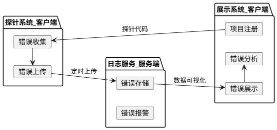
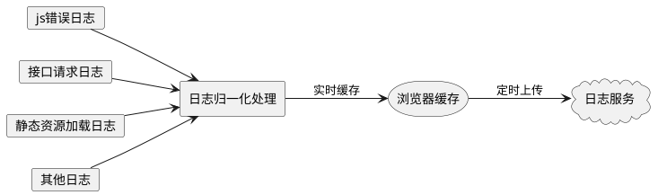

# 日志监控系统设计

## 目标

- 错误日志实时上报
- 支持在线错误分析，`sourcemap`源码定位
- 支持自定义错误格式/埋点上传
- 代码性能检测，接口耗时，首屏加载速度等
- 跟踪具体用户的所有行为(截图/`录屏`上传)
- 支持pc及`微信小程序`

## 初步方案设计

### 错误监控系统

```plantuml

@startuml

left to right direction

folder 探针系统_客户端 as log {
    card 错误收集 as A
    card 错误上传 as B
    A->B
}
folder 展示系统_客户端 as S {
    card 错误展示 as C
    card 错误分析 as CC
    card 项目注册 as P
    CC<-C
}
folder 日志服务_服务端 as service {
    card 错误存储 as R
    card 错误报警 as RR
}

B-->R: 定时上传
R-->C: 数据可视化
A<--P: 探针代码

@enduml

```

### 探针系统-客户端

```plantuml

@startuml

    left to right direction
    card js错误日志 as A
    card 接口请求日志 as B
    card 静态资源加载日志 as C
    card 其他日志 as D

    rectangle 日志归一化处理 as log
    storage 浏览器缓存 as cache
    cloud 日志服务 as service

    A --> log
    B --> log
    C --> log
    D --> log

    log-->cache:实时缓存
    cache-->service:定时上传

@enduml

```
